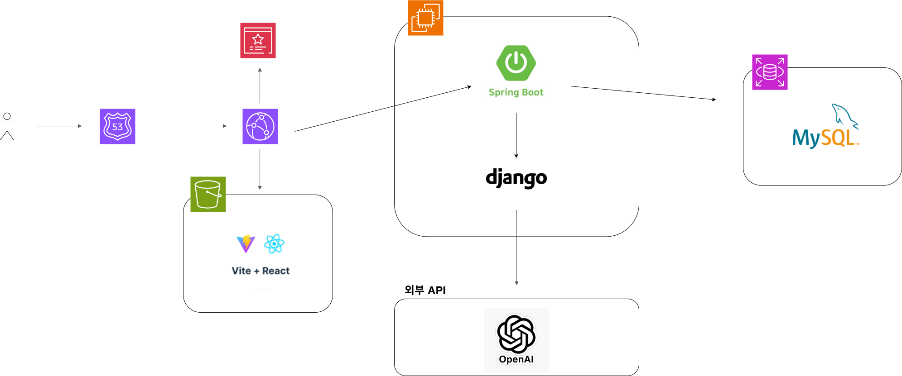
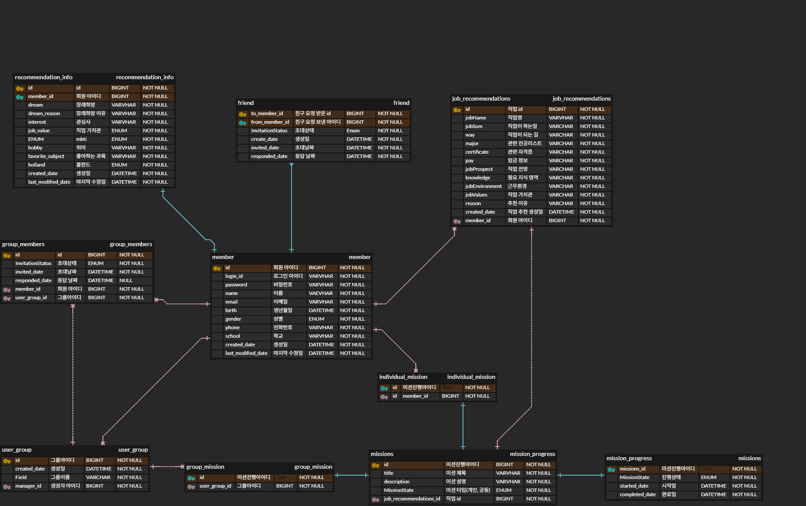

# 🧭 What Will You Be - Backend Server

> **청소년을 위한 AI 기반 직업 추천 서비스**  
> 사용자의 성향(MBTI, Holland 등)을 분석하여 맞춤형 직업을 추천하여 제공합니다.
>
> **개발 기간:** 2024.07 ~ 2024.10 (4개월)  
> **팀 구성:** 4인 (Frontend 1, Backend 1, AI 2) - 이기종 서버 간 협업
>
> My Role (Backend)
> - 추천 요청–응답 전체 파이프라인 설계 및 구현
> - Spring ↔ Python AI 서버 통신 구조 설계 및 장애 해결
> - 테스트 환경 구축 및 라인 커버리지 90% 달성

<div align="left">
    
    
    
    
    
</div>

<br>

## 📌 Project Overview
이 프로젝트는 **'What Will You Be'** 서비스의 백엔드 API 서버입니다.  
사용자 데이터 관리뿐만 아니라, **Python AI 서버와의 통신을 통한 직업 추천 파이프라인**을 구축하고 **안정적인 서비스 운영을 위한 테스트 코드 작성**에 중점을 두었습니다.

* **핵심 역할:** RESTful API 설계, 이기종 서버(Java ↔ Python) 간 통신 구현, 테스트 환경 구축
* **주요 목표:** `RestClient`를 활용한 **안정적인 외부 API 연동**
    * AI 데이터 처리를 고려한 **데이터 정합성 보장**
    * **테스트 커버리지(Line Coverage) 90% 달성**을 통한 시스템 안정성 확보

<br>

## 🛠️ Tech Stack

| Category | Technology | Description |
| --- | --- | --- |
| **Language** | Java 17 | 안정성과 호환성이 검증된 표준 LTS 버전 |
| **Framework** | Spring Boot 3.x | 빠르고 안정적인 서버 구축 |
| **Database** | MySQL 8.0 | 데이터 영속성 관리 (JPA 활용) |
| **Network** | Spring 6 RestClient | Python AI 서버와의 통신 인터페이스 |
| **Testing** | JUnit5, Mockito, RestAssured, Jacoco | 단위/통합 테스트 및 커버리지 분석 (90% 달성) |
| **Build Tool** | Gradle | 빌드 및 의존성 관리 |

<br>

## 🏛️ System Architecture & Logic

전체 시스템은 **React(Front) ↔ Spring Boot(Main Server) ↔ Django(AI Server)** 구조로 구성되어 있습니다.

* **Spring Boot 서버의 역할**
  * 클라이언트 요청을 받아 데이터를 가공
  * AI 서버와 통신하여 분석 결과를 클라이언트에 전달하는 역할

* **서버 분리 설계**
  * AI 분석 로직의 변경이나 장애가
    API 서버의 도메인 로직에 직접적인 영향을 주지 않도록
    **논리적으로 역할을 분리**
  * 분석 로직과 서비스 로직을 분리하여
    **유지보수성과 변경 용이성을 확보**



### 🔄 AI 직업 추천 프로세스 (Core Logic)
1.  **Client Request:** 사용자가 직업 추천을 요청합니다.
2.  **Data Assembly:** 백엔드는 DB에서 사용자의 `RecommendationInfo`(MBTI, 관심사, 가치관 등)를 조회하여 `PythonApiRequestDto`로 변환합니다.
3.  **AI Server Communication:** `RestClient`를 통해 Python 서버로 데이터를 전송합니다.
4.  **Result Processing:** Python 서버의 분석 결과를 받아 유효성을 검증하고, `JobRecommendations` 엔티티로 변환하여 DB에 저장합니다.
5.  **Response:** 최종적으로 클라이언트에게 추천된 직업 목록을 반환합니다.

<br>

## 🔑 Key Technical Decisions

### 1. Spring 6 RestClient 도입
* **배경:** Python 서버와 통신할 기술이 필요했습니다. RestTemplate은 더 이상 신규 기능이 추가되지 않는 Legacy API가 되었으며, 대안인 WebClient는 단순한 동기 통신 환경에 도입하기에는 **학습 비용과 불필요한 의존성** 이 과도했습니다.
* **결정:** Spring Boot 3.2의 `RestClient`를 도입했습니다. 기존의 동기(Blocking) 방식을 유지하면서도, Fluent API를 통해 직관적이고 가독성 높은 통신 로직을 구현했습니다.

### 2. 테스트 라인 커버리지 90% 달성
* **목표:** 복잡한 로직(AI 추천 결과 가공, 데이터 변환 등)의 신뢰성을 확보하고, 리팩토링 시 사이드 이펙트를 방지하고자 했습니다.
* **전략:** 
  * **Unit Test:** `Mockito`를 활용하여 외부 의존성(Repository, Python API 등)을 격리한 상태에서 비즈니스 로직을 검증했습니다.
  * **Integration Test:** `RestAssured`를 사용하여 실제 요청부터 DB 저장까지의 전체 흐름을 검증했습니다.
* **결과:** **라인 커버리지 90%를 달성**하여 배포 전 잠재적인 버그를 사전에 차단할 수 있는 안정적인 환경을 구축했습니다.

<br>

## 🚀 Troubleshooting (HTTP Communication Issue)

### 🔥 Issue: Python AI 서버 통신 시 Chunked Encoding 호환성 문제
* **상황 (Situation):** Spring Boot의 기본 Jackson 컨버터는 HTTP 응답 시 `Transfer-Encoding: chunked`를 사용합니다. 하지만 연동해야 하는 Python AI 서버가 이를 제대로 처리하지 못해 **파이썬 서버에 빈 바디(Empty Body)로 요청이 도착하는 문제**가 발생했습니다.
* **원인 (Cause):** `Content-Length` 헤더가 명시되지 않아 수신 측(Python)에서 바디의 길이를 인지하지 못하고 데이터를 읽지 못함.
* **해결 (Action):** `Content-Length`를 명시적으로 계산하여 전송하는 커스텀 컨버터([FixedLengthJsonMessageConverter](./src/main/java/com/example/whatwillyoube/whatwillyoube_backend/util/FixedLengthJsonMessageConverter.java))를 직접 구현하고 `RestClient` 설정에 적용했습니다.
    ```java
    // 메모리 효율을 위해 String 변환 없이 byte 배열 길이 계산 방식 적용 (FixedLengthJsonMessageConverter.java)
    @Override
    protected Long getContentLength(Object object, MediaType contentType) throws IOException {
        // 실제 전송 전 길이를 계산하여 헤더에 설정
        return calculateSize(object);
    }
    ```
* **결과 (Result):** AI 서버와의 통신 성공률 **100% 달성** 및 데이터 누락 없는 안정적인 파이프라인 구축 완료.

<br>

## 📂 ERD (Entity Relationship Diagram)
데이터베이스 구조는 아래와 같습니다. `Member`를 중심으로 `RecommendationInfo`(입력 정보)와 `JobRecommendations`(결과 정보)가 연관관계를 맺고 있습니다.



<br>

## 📄 API Documentation
상세한 API 명세는 별도 문서로 관리하고 있습니다.
* 👉 **[API 명세서 바로가기 (API_DOCUMENTATION.md)](./API_DOCUMENTATION.md)**

<br>